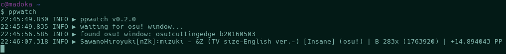

ppwatch
=======



A simple command-line application to give you updated PP counts as you
play osu!.

Usage
-----

1. Register an API key on the [osu! API page][api], and copy it.
2. Download a ppwatch binary from [the Releases page][releases], and run it,
   filling in your username and API key when prompted (you'll only have to do
   this once, it'll remember your information afterwards)
3. Done!

[api]: https://osu.ppy.sh/p/api
[releases]: https://github.com/txanatan/ppwatch/releases

Advanced usage
--------------

There is a `-json` flag, which will output rank information in JSON on stdout,
and logging information (errors, etc) on stderr, as JSON hashes.

Example rank information:

```json
{"time":"2016-05-03T18:45:52Z","gamemode":"osu","beatmap":"SawanoHiroyuki[nZk]:mizuki - \u0026Z (TV size-English ver.-)","beatmap_id":593823,"difficulty":"Insane","rank":"B","score":1763920,"maxcombo":283,"perfect":false,"gainedpp":0}
```

Example logging information:

```json
{"level":"info","msg":"found osu! window: osu!cuttingedge b20160503","time":"2016-05-03T22:49:06+12:00"}
```

The process name and window title to check for can be changed in `.ppwatch.yml`
via the `process` and `partialtitle` keys.

Debug logging can be enabled with the `-debug` flag, which may be useful if
something goes wrong.

Compiling
---------

`go get github.com/txanatan/ppwatch`

License
-------

The MIT License (MIT)

Copyright (c) 2015 Alice Jenkinson

Permission is hereby granted, free of charge, to any person obtaining a copy
of this software and associated documentation files (the "Software"), to deal
in the Software without restriction, including without limitation the rights
to use, copy, modify, merge, publish, distribute, sublicense, and/or sell
copies of the Software, and to permit persons to whom the Software is
furnished to do so, subject to the following conditions:

The above copyright notice and this permission notice shall be included in all
copies or substantial portions of the Software.

THE SOFTWARE IS PROVIDED "AS IS", WITHOUT WARRANTY OF ANY KIND, EXPRESS OR
IMPLIED, INCLUDING BUT NOT LIMITED TO THE WARRANTIES OF MERCHANTABILITY,
FITNESS FOR A PARTICULAR PURPOSE AND NONINFRINGEMENT. IN NO EVENT SHALL THE
AUTHORS OR COPYRIGHT HOLDERS BE LIABLE FOR ANY CLAIM, DAMAGES OR OTHER
LIABILITY, WHETHER IN AN ACTION OF CONTRACT, TORT OR OTHERWISE, ARISING FROM,
OUT OF OR IN CONNECTION WITH THE SOFTWARE OR THE USE OR OTHER DEALINGS IN THE
SOFTWARE.
